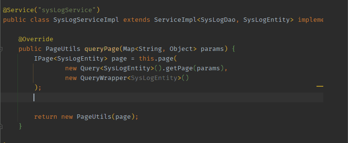

# CapslockMagic

All my effort is the parody of Ruohang Feng (Vonng) &amp;  Salted Fish Akang (xianyukang).

我所有的努力都是对冯若航和咸鱼阿康的拙劣模仿。

---
 
## 历史版本比较

`Magic` 继承了 `Capslock Enhancement` 的经典设计（类似 HHKB 键盘），弥补了它在 Windows 平台的遗憾。

`Magic` 吸收了 `MyKeymap` 的实现细节和设计灵感，并修复了脚本语言向上兼容，采用面向对象的现代编码风格，让开发者更容易拓展和上手维护。

`Magic` 重写了 **新输入法**，可以管理任意的用户指令集，获得念咒语般的魔法。

| 序号 | 功能特色 | Enhancement                                         | MyKeymap                                                      | Magic                                                              |
| ---- | -------- | --------------------------------------------------- | ------------------------------------------------------------- | ------------------------------------------------------------------ |
| 🌐    | Github   | [Vonng/Capslock](https://github.com/Vonng/Capslock) | [xianyukang/MyKeymap](https://github.com/xianyukang/MyKeymap) | [miozus/CapslockMagic](https://github.com/miozus/CapslockMagic)    | 使用说明书 |
| 💻    | 支持平台 | 主: MacOS </br> 次: Windows                         | 仅限 Windows11/10                                             | 主: Windows 11/10 </br> 次: MacOS                                  |
| ⌨️    | 推荐配列 | 87 键                                               | 60 键                                                         | 60 键                                                              |
| 🧰    | 开发软件 | Kirabiner：不可二次开发                             | AutoHotkey V1：普通脚本风格                                   | AutoHotkey_H_V2 ： 面向对象的现代风格，类似 JavaScript，支持多线程 |
| ⚙️    | 配置文件 | 难读的超长 json / yaml 本文                         | 内置网页服务，非常友好                                        | 源码即配置，拓展灵活，适合开发者                                   |
| 👾    | 启动程序 | ✅ 仅打开                                            | ✅支持同类窗口切换                                             | ✅ 支持同类窗口切换                                                 |
| 📺    | 窗口调整 | ✅ 需安装 Zoom                                       | ✅ 位置和移动                                                  | ✅ 仿写 Zoom（内置）                                                |
| 🖱️    | 鼠标操作 | ✅ 要双手按住                                        | ✅ 要双手按住                                                  | ✅ 按下进入高光时刻，单手操作                                       |
| ✏️    | 新输入法 | ❌                                                   | ✅ 分号模式：指令集                                            | ✅ 分号模式进阶版：用户词库、指令集等，可同步 MacOS                 |
| #️⃣    | 特殊符号 | ❌                                                   | ✅ 重排列到字母键位                                            | ✅ 重排列到字母键位（改良）                                         |
| 3️⃣    | 数字模式 | ❌                                                   | ✅ 数字小键盘                                                  | ✅ 数字小键盘 + <kbd>F1~12</kbd>                                    |
| `I`  | 光标编辑 | ✅ 方向移动和前后删除                                | ❌                                                             | ✅ 方向移动和前后删除                                               |

## Magic 增强功能

🔫 **中英文切换自动管理**

重点优化了写代码注释的体验。

- 开发者在各种编辑器 `VSCode`、`Intelj Idea`、`Vim` 写完注释后，按 <kbd>Caps</kbd> 可以直接返回到 `Normal` 模式。
- 如果切换到 `Notion` 写文档，默认使用中文，切回 IDE 默认变回英文。
- 实现原理
  - 按下 <kbd>Caps</kbd> （映射 <kbd>Esc</kbd>） 或鼠标单击时，脚本会使用图像识别，全屏检测一次 `中文输入法现在处于什么模式？`，如果是中文，就切换回英文。
    - 默认微软拼音。如果用搜狗拼音，配置切换接口即可，甚至不用图像识别。
    - 特殊的中文标点符号：已内置在词典中，以备不时之需。
    - 闲鱼阿康的解决方案：推荐禁用中文输入法了。（太简单粗暴了。）

🪛 **屏蔽热键**

屏蔽了微软 <kbd>Win</kbd> 键相关的 `一年也用不上几次但几百年都存在` 的组合键，做组合键的吝啬鬼。

🧩 **内置插件**

`Notion.ahk` 支持粘贴不同语言的代码块、调整`block`折叠或无序列表，左手删除字符，代码块语言格式;去掉粘贴文本格式等功能。

## 快速开始

#### 1. 下载

```bash
git clone https://github.com/miozus/CapslockMagic.git
```

#### 2. 运行

**2.1 Windows**

- 解压压缩包`tools\AutoHotkey_H\AutoHotkey_H-beta.3-fixed.3-author-thqby.7z` 
  - 也可以在 [thqby/AutoHotkey_H](https://github.com/thqby/AutoHotkey_H.git) 下载发行版
- 右键点击 `AutoHotKey.exe` 安全-兼容性-勾选管理员权限
- 右键单击 `CapslockPlus.ahk` 打开方式，选择到选择上述目录的 `AutoHotKey.exe` 打开。

**2.2 MacOS**

Ps. Magic版本 在 MacOS 平台也用 Kirabainer，只是额外增加了一个 `特殊符号` 的插件。没有新输入法的功能。

2.2.1 下载

```bash
wget https://github.com/Vonng/Capslock/blob/master/mac_v3/capslock.yml -P ~/opt/config/capslock.yml 
```

2.2.2 修改

- 复制 `tools\kirabiner\capslock-magic.yml` 替换 `capslock.yml` 开头

2.2. 3 终端运行

```bash
# zsh
yq eval -j -I=2 ~/opt/config/capslock.yml > ~/.config/karabiner/assets/complex_modifications/capslock.json
# 查看是否成功
open -a Karabiner-Elements
```

## 如何使用

将 ⇪CapsLock（大写锁定键）改造为一个强力的功能修饰键（✱ Hyper ），奇迹般地提高操作效率与生产力。


参考中文文档: [CapsLock-Enhancement](https://github.com/Vonng/Capslock/tree/master/docs/zh-cn)

基本操作逻辑一致的，原作者写的很详细，感兴趣的功能直接用键盘试一试，这里不再赘述。

只说两个好玩的功能：

### ⌨️ 新输入法



| 键盘输入                                                          | 显示   | 说明                                             | 分号模式 |
| ----------------------------------------------------------------- | ------ | ------------------------------------------------ | -------- |
| <kbd>;</kbd>                                                      | 🙈      | 等待输入密令，猴子不看                           | 进入     |
| 假如 <kbd>c</kbd> <kbd>n</kbd> <kbd>e</kbd>                       | cn     | 匹配到了用户词典（纯字符串） 1️⃣，直接输出代码片段 | 退出     |
| 假如 <kbd>c</kbd> <kbd>n</kbd> <kbd>k</kbd>                       | cnk    | 尚未匹配到，继续等待                             | 等待     |
| <kbd>⏎</kbd>                                                      | 💨      | cnk 不存在，猴子跑了                             | 退出     |
| <kbd>Esc</kbd>                                                    |        | 随时可以中断                                     | 退出     |
| 假如 <kbd>s</kbd><kbd>l</kbd><kbd>e</kbd><kbd>e</kbd><kbd>p</kbd> | slee   | 匹配用户词典（函数名） 2️⃣，执行指令               |
|                                                                   | 🙉 睡眠 | 电脑马上进入休眠状态，猴子惊讶你竟然猜对啦       | 退出     |

在 `data\UserDictionary.ahk` 中，使用 map 数据结构保存着用户词典。

- key：自定义的缩写，怎么好记怎么来。
- value: 指令集，主要分为两类
  - 1️⃣ **`xxDict` 纯字符串**。其他所有的变量 都是这类，比如代码片段（支持换行和缩进），邮箱，网址，emoji 等。
  - 2️⃣ **`secretDict` 函数名**。它代表用户定义的一系列 AHK 指令集的可执行函数。
    - 这里设计为必须写注释，不写不生效。
      - 此处写 `"sleep", "睡觉"`
      - 还要在 `bin\SemicolonHook.ahk` 的`execSemicolonAbbr` 方法中添加一种情况 `case "sleep": computerGoSleep()`
    - 技巧：它可以用来写 Vim 的宏，完美的跨软件运行方案。

### 🔟 数字模式


按住 <kbd>3</kbd> 不松手，处在数字模式，松开时退出。

| 键盘输入     | 映射到        | 说明 |
| ------------ | ------------- | ---- |
| <kbd>2</kbd> | <kbd>F2</kbd> |
| <kbd>J</kbd> | 4             |
| <kbd>N</kbd> | 空格键        |

想象成稍微倾斜的数字小键盘，方便输入手机号码、坐标、确认、删除。

## 常见问题

1. 可以设置开机自启吗？

不可以，一般管理员权限的软件都不能开机自启，这是所有 AutoHokey 都会面临的 PAC 问题。但你可以将它加入计算机启动计划，或者尝试使用 `bat` 脚本运行，将脚本加入开机自启的目录（运行`shell:startup`），来实现开机自启。

- 它需要管理员权限来控制`sehll` ，降权打开 VSCode。
- 如果不给管理员权限，遇到有些系统软件，脚本就失效了。

2. 怎么将插件用户词典（.ahk）转换成苹果用户词典（.plist）呢？
   1. 在Plus 文件前面，启用插件：（mapObjectUtils）这一行去掉注释符号#
   2. `mapObjectUtils` 底部，开启接口函数快捷方式，文件底部去掉注释符号#
   3. Dcit 用户词典文件底部，开启 MacObject 列表的注释符号#
   4. 打开 `json2plit.py`（使用pip安装需要的库），如果失败了，需要继续手动执行以下步骤
   5. 按下步骤 `2` 的快捷键，设置系统区域语言为兼容 UTF-8 ，弹窗提示得到 `userDict0309.json`
   6. 复制内容粘贴到步骤 `4` 中函数注释的网站，点击转换（网站抽风，可能需要在线校验 JSON 格式再拷贝回来），转换后得到类似 XML 的`.plist` 格式字典，点击复制
   7. 新建 `.plist` 文件，粘贴内容进去，替换为双引号 `&#13;&#13; -> ""`
   8. 使用局域网共享，将此文件传给苹果电脑，然后打开设置-输入法偏好设置，直接拖放在左边栏。这样拼音打字时，会根据 key 映射出字符片段。
   ps. 很麻烦是吧，所以自己想更好的办法同步用户词典吧。
